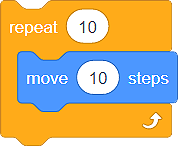
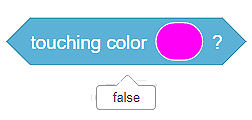
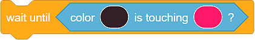
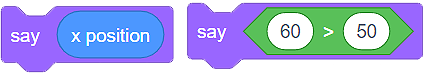

Блокове
=======

Компютърните програми са група от команди, които използваме, за да обясним на компютъра как да извърши определена задача или да разреши проблем. Имайки предвид, че повечето програмни езици са текстови, разработчиците често пишат командите.

Във визуалния програмен език Скрач не пишем командите, а използваме блокове, които ги представляват. Създаваме програмите, като подреждаме (нареждаме на купчини) блоковете в правилен ред.

Видове блокове в Скрач
----------------------------

Има 4 вида блокове в Скрач: 

.. image:: ../_images/blokovi/4Bloka.png   
   :align: center

1.	Команден блок;
2.	Блокове, които свързват събития с действието на програмата;
3.	Блокове, които контролират действието на програмата;
4.	Блокове, които докладват дадена стойност (блокове за функции).

Командни блокове
~~~~~~~~~~~~~~~~~

Командните блокове имат вдлъбнатини отгоре и издатини отдолу. Те са проектирани по начин, който им позволява да са свързани в други блокове. Можем просто да извлачим един блок от уместната категория в пространството за програмиране и да го свържем с други блокове, които вече са там. Свързването на блоковете изглежда като магнетично привличане – в момента, в който поставим вдлъбнатината на един блок близо да издатината на друг, той ще се залепи за него и по такъв начин се продължава последователността. Издатините позволяват добавянето на нови блокове.     

Блокове, които свързват събития с действието на програмата
~~~~~~~~~~~~~~~~~~~~~~~~~~~~~~~~~~~~~~~~~~~~~~~~~~~~~~~~~~~

.. |Costume| image:: ../_images/blokovi/Costume.png
.. |XP| image:: ../_images/blokovi/XP.png

.. |Sabiranje| image:: ../_images/blokovi/Sabiranje.png

Тези блокове имат „шапки”. Това означава, че те могат да бъдат поставяне единствено в началото на купчината от блокове. Обикновено започваме текста с един от тези блокове. Отдолу имат издатини, което позволява нови блокове да се добавят към тях.

Важно е да се знае, че тези блокове представляват бутони за задействане на текста, прикачен към тях.  Например, блокът (image) подсигурява, че командните блокове, прикрепени към него, се задействат само когато зеленият флаг, разположен над сцената, е кликнат.

Блокове, които контролират действието на програмата
~~~~~~~~~~~~~~~~~~~~~~~~~~~~~~~~~~~~~~~~~~~~~~~~~~~~

Подобно на командните блокове, тези, които контролират действието на програмата, имат вдлъбнатини на върха и издатини на дъното. Можем да ги поставим над други блокове, както и да поставяме други блокове под тях. 

Тези блокове също се характеризират със способността да побират други блокове в себе си. Например, текстът (image) позволява на спрайта да се движи с 10 стъпки 10 пъти.

Блокове, които докладват дадена стойност (блокове за функции)
~~~~~~~~~~~~~~~~~~~~~~~~~~~~~~~~~~~~~~~~~~~~~~~~~~~~~~~~~~~~~~

Освен по формата си, тези блокове се различават от другите, защото сами по себе си не могат да бъдат част от текста. С други думи, те не се добавят към други блокове, а формират вътрешна част от блока, в който са вкарани.

Блоковете за функции съдържат определена стойност. Тяхната външност зависи от вида информация, която съдържат:

•	блоковете със заоблени краища съдържат числа  |XP| или връзки |Costume|;
•	ъгловите блокове съдържат стойности *True-Вярно* или *False-Грешно* |Touch|.

Командните блокове и блоковете, които контролират действието на програмата имат вътрепни полета, в които блоковете за функции могат да бъдат въведени. Тези вътрешни полета могат да имат кръгла или шестоъгълна форма.

.. infonote::

    |Vazno| В блоковете, които имат кръгли вътрешни полета |SayE|, можем да въвеждаме както кръгли, така и шестоъгълни блокове за функции |Say|, докато блоковете с шестоъгълни вътрешни полета |WUE|, могат да приемат само шестоъгълни блокове за функции |WU|.

До блоковете за функции в категориите, където са разположени, има кутийки, които можем да чекваме. Когато чекнем кутийките, стойността, събрана в тези блокове, ще стане видима на сцената. 

Стойността, събрана в един блок за функции, може също да бъде видяна чрез кликване на самия блок. Например, блокът |Touching| съдържа стойността грешно, защото нашият спрайт не докосва показания цвят, докато блокът |Sabiranje| съдържа стойността 22, защото това е сумата от числата, които виждаме в блока. 

.. mchoice:: BlokoviZadatak1
   :answer_a: Когато кликнем на зеления флаг, спрайтът ще каже "вярно".
   :answer_b: Когато кликнем на зеления флаг, спрайтът ще каже "грешно".
   :feedback_a: Браво!    
   :feedback_b: Ъгловият функционален блок връща стойностите True или False. Тъй като декларацията е 60>50 вярно, спрайтът ще каже "вярно".
   :correct: a

   Анализирай текста, показан във фигурата. Избери резултата от действието на програмата.
     .. image:: ../_images/blokovi/6050.png  
	:align: center