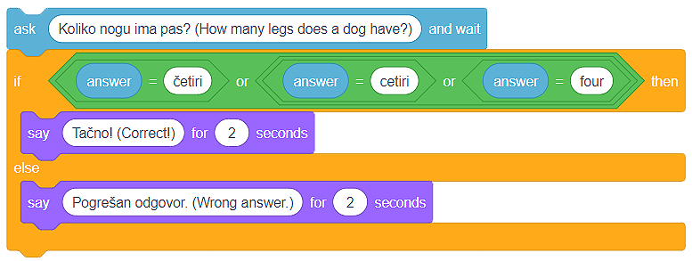

Разклоняване
=============

.. |If| image:: ../_images/grananje/If.png
.. |IfElse| image:: ../_images/grananje/IfElse.png

.. |Or| image:: ../_images/grananje/Or.png
.. |Not| image:: ../_images/grananje/Not.png

Споменахме, че повтарянето на една или повече команди (блокове) е важна концепция в програмирането. 

Еднакво полезна и значима е концепцията за **програмно разклоняване**. **Разклоняването** позволява дадена група от блокове да бъде изпълнена от програмата, докато другите – не. Кои команди ще действат зависи от изпълнението на условията. Разбираме условието като твърдение, което може да бъде **вярно** или **грешно**.

EВъпреки че досега създавахме програми, които задействат команди една след друга от началото до края на програмата, повечето от програмите съдържат разклонения. 

Има два блока за разклоняване и те са разположени в категорията **Контрол-Control**:

•	Блокът |If| проверява условието и ако условието е **вярно**, задейства блоковете, държани в него, и
•	Блокът |IfElse| проверява условието и ако условието е **вярно**, задейства една група от команди, а ако условието е **грешно**, задейства друга група. 

.. |VeceOd| image:: ../_images/grananje/VeceOd.png
.. |Jednako| image:: ../_images/grananje/Jednako.png

Един начин да определим дали дадено условие е изпълнено е да изберем от категорията **Оператори** един от **сравняващите оператори**:

•	по-голямо от |VeceOd|; 
•	по-малко от |ManjeOd|;
•	равно на |Jednako|.

.. mchoice:: GrananjeZ1
   :answer_a: В резултат на стартиране на скрипт A, програмата ще напише изречение "Ще купя сладолед!".
   :answer_b: Изпълнението на скрипт А и Б ще има същия резултат - програмите ще напишат изречение "Ще купя сладолед!".
   :answer_c: В резултат на стартиране на скрипт Б програмата ще напише изречение "Ще купя сладолед!".
   :feedback_a: Погледнете внимателно оператора за сравнение в сценария А. Вярваме, че можете да видите, че програмата ще напише изречението "Ще купя сладолед!" само ако цената на сладоледа е под 100 монети.     
   :feedback_b: Анализирайте как се определя операторът за сравнение в скрипт A и как е в сценарий B. Вярваме, че можете да видите това в сценарий A изречението "Ще купя сладолед!" ще се изписва само ако цената на сладоледа е под 100 монети. Изпълнявайки сценарий B, изречението "Ще купя сладолед!" ще бъде написано, ако цената е по-малка или равна на 100 монети.
   :feedback_c:  Браво! Програмата ще напише изречението "Ще купя сладолед!" ако цената е по-малка или равна на 100 монети. 
   :correct: c

   Цената на сладолед е 100 монети. Анализирай текстовете, представени на фигурата, и избери правилното твърдение.

   .. image:: ../_images/grananje/Sladoled.png
      :align: center

Най-лесният начин да разберем разклоняването е като създадем програма, която симулира тест. Когато питаме потребителя въпрос и изчакаме неговия отговор, се очаква, че ще осигурим обратна връзка дали отговорът е бил правилен или не. Можем единствено да предоставим информация за правилността на отговор, ако определим дали отговорът на потребителя е идентичен с правилния отговор. 

.. image:: ../_images/grananje/Kviz1.png
   :align: center

Въпреки че изглежда сякаш сме написали кода правилно и правилният отговор на въпроса „Колко крака има кучето?” е 4, потребителят би могъл да отговори на въпроса, като напише дума, вместо число. С други думи, правилният отговор на въпроса не е само 4, но също така и:

•	четири; 
•	cetiri;
•	four.

Очевидно е, че трябва да дефинираме условието по-внимателно, тоест, да приемем всеки възможен правилен отговор.

Можем да преодолеем тази ситуация чрез използването на **логически оператори**, които можем да намерим в категорията **Оператори**:

•	и |And|; 
•	или |Or|;
•	не |Not|.

В нашия случай правилният отговор може да бъде 4 или four или cetiri или четири. Затова ще използваме оператора |Or| няколко пъти, за да дефинираме условието.

.. image:: ../_images/grananje/Uslov.png
   :align: center

Кодът, който приема всички възможни форми на правилния отговор изглежда така:

.. |Uradi| image:: ../_images/Uradi.png

|Uradi| Децата са свикнали с тъчскрийн устройствата  и не са свиклнали много с мишката. Ще им помогнем да развият това умение, като създадем програма със спрайт **Камион** и с **Път за фон**. Камионът трябва да следва мишката на потребителя и да отиде от лявата до дясната страна на сцената. По пътя камионът не трябва да докосва ръба на пътя. Ако камионът докосне ръба в който и да е момент, ще се върне в първоначалната си позиция (начална позиция в началото на пътуването от лявата страна на сцената - x: -226, y: -41). За създаването на тази програма те съветваме да използваш проекта **Пътуване**, който можеш да намериш на |https://scratch.mit.edu/projects/326419371/|.

.. |https://scratch.mit.edu/projects/326419371/| raw:: html

 <a href="https://scratch.mit.edu/projects/326419371/" target="_blank">https://scratch.mit.edu/projects/326419371/</a>

.. image:: ../_images/grananje/Putovanje.png
   :align: center

Както можем да видим, спрайтът Камион е твърде голям за тесния път, нарисуван на фона на сцената, която използваме в тази програма. Можем също да видим, че пътят е бял и че черна линия разделя пътя от тревата. Трябва да имаш предвид тези неща, ако искаш да създадеш програмата сам.

.. reveal:: sakrivanjeGrananje1
   :showtitle: Виж едно от възможните решения
   :hidetitle: Скрий решението
 
   **Възможен отговор**
     
   .. image:: ../_images/grananje/Putovanje1.png 
	:align: center

.. |Izazov| image:: ../_images/Izazov.png

|Izazov| Щеше да е добре, ако нашата програма можеше да измери колко ще отнеме да потребителя да „закара” камиона до края на пътя. Подобри програмата. Като добавиш текст, който ще измери времето, нужно на потребителя да завърши пътуването.

.. reveal:: sakrivanjeGrananje2
   :showtitle: Виж едно от възможните решения
   :hidetitle: Скрий решението
 
   **Възможен отговор**
     
   .. image:: ../_images/grananje/Putovanje2.png 
	:align: center

|Izazov| Използвайки концепциите и техниките, показани в този и в предишните уроци, създай програма, която симулира парола за влизане, когато се работи на компютъра. Нека програмата позволява на потребителя да въведе паролата три пъти. Ако потребителят не успее да въведе правилната парола, програмата ще спре да работи. Ако потребителят успее, спрайтът ще смени костюма си. Препоръчваме да използваш проекта, който можеш да намериш на линка |https://scratch.mit.edu/projects/326403173/|, където поставихме спрайта Лаптоп, който има два костюма. Късмет!

.. |https://scratch.mit.edu/projects/326403173/| raw:: html

 <a href="https://scratch.mit.edu/projects/326403173/" target="_blank">https://scratch.mit.edu/projects/326403173/</a>

.. reveal:: sakrivanjePonavljanje1
   :showtitle: Виж едно от възможните решения
   :hidetitle: Скрий решението
 
   **Възможен отговор**
     
   You will find our solution in the project **Password solution**, at |https://scratch.mit.edu/projects/326417414/|. We recommend you remix the project and explain our solution by using comments. We know you can do it!

.. |https://scratch.mit.edu/projects/326417414/| raw:: html

 <a href="https://scratch.mit.edu/projects/326417414/" target="_blank">https://scratch.mit.edu/projects/326417414/</a>