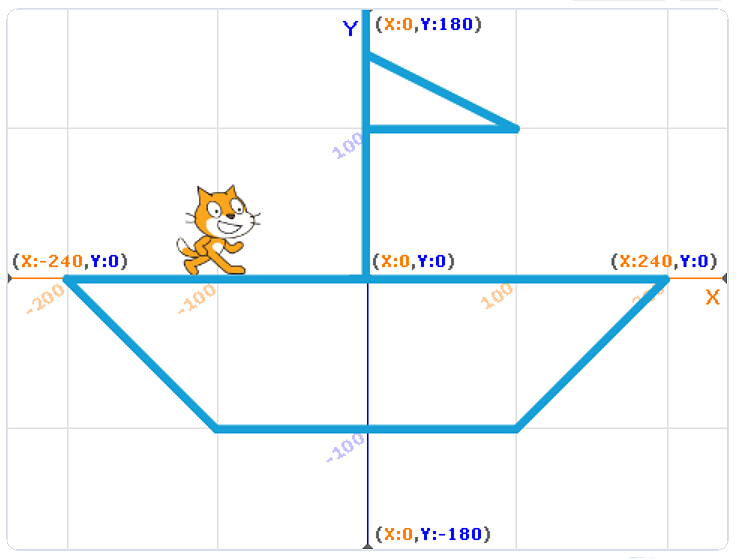

Рисуване
=========

В Скрач всеки спрайт имат скрит химикал и способността да оставя живи следи на сцената, когато се движи. 

Ако искаме да рисуваме, трябва да използваме блоковете от категорията **Химикал**. Първо, трябва да добавим тази категория блокове към интерфейса Скрач. Можем да направим това, като кликнем на бутона |Ekstenzija|, който се намира в долния ляв ъгъл на екрана, и изберем продължението **Химикал**.
  .. |Ekstenzija| image:: ../_images/Ekstenzija.png

.. image:: ../_images/crtanje/ekstOlovka.png 
   :align: center

Нова категория от блокове **Химикал** ще се появи в менюто **Kод**. В тази категория имаме 9 блока, които можем да използваме за рисуване на сцената. С тези блокове можем да изтрием всичко, което сме нарисували на сцената *(изтрий всичко)*, да оставяме и вдигаме химикала *(химикал долу, химикал горе)*, да контролираме лесно цвета и размера на химикала *(определи цвят на химикала, смени цвят на химикала, определи размер на химикала, смени размера на цвета на химикала)*.

Първоначално спрайтът има химикал във вдигната позиция. **За да можем да рисуваме, трябва да оставим химикала.**

„Свободно” рисуване
-------------------------

.. |LikOlovka| image:: ../_images/crtanje/LikOlovka.png
  		    :width: 70px
.. |OK1| image:: ../_images/kretanje/OK1.png

.. |Uradi| image:: ../_images/Uradi.png

Когато мислим за свободно рисуване, обикновено си се представяме рисуващи с химикал. Затова ще използваме спрайта |LikOlovka| молив, за да създадем програма, която ще симулира свободния стил на рисуване. Можем да намерим този спрайт в Спрайт библиотеката. 

В Скрач спрайтовете рисуват със своята среда. Ако искаме да рисуваме с молив, ще трябва да сменим средата на спрайта. Можем да направим това в менюто **Костюми**. 

ВИДЕО – СРЕДАТА НА СПРАЙТА

Когато изследваме движението на спрайта на сцената, ние представяме блока |OK1|. Ако използваме тези блокове безкрайно много пъти *(Завинаги)*, спрайтът ще се движи непрекъснато около сцената, следвайки стрелката на мишката. Следователно можем да използваме този блок да симулираме рисуване – като движим стрелката на мишката по сцената, ние ще рисуваме по сцената.
    
Анализирай следните текстове:

.. image:: ../_images/crtanje/KodSR.png  
   :align: center

|Uradi| Създай програма, която позволява свободно рисуване и подсигури, че програмата спира да действа, когато натиснеш копчето **с**. Потърси подходящите блокове в категориите **Събития** и **Контрол**. 

Контролиране на движението на спрайта чрез използването на клавиатурата и рисуване
-----------------------------------------------------------------------------------

Това е страхотна възможност да използваме блоковете, които позволяват на спрайта да се движи с помощта на стрели, и да ги подобрим дори повече, като накараме спрайта да рисува линии с даден цвят и размер. 

Направи така, че спрайтът да рисува по следния начин:

•	Докато се движи надясно, да рисува синя линия с размер 5 пиксела;
•	Докато се движи наляво, да рисува зелена линия с размер 10 пиксела;
•	Докато се движи нагоре, да рисува червена линия с размер 15 пиксела;
•	Докато се движи надолу, да рисува жълта линия с размер 20 пиксела.

Създай следните блокове:

.. image:: ../_images/crtanje/strelicebojadebljina.png
   :width: 840px   
   :align: center

Нарисувахме изображението, което виждаш отдолу:

Опитай се да създадеш програма, която да нарисува подобно изображение.

Абсолютно движение и рисуване
-------------------------------

Анализирайки изображението отгоре, можем да видим, че няма да бъде трудно да определим точките, които трябва да свържем, за да нарисуваме лодката.  

|Uradi| Създай програма, която ще нарисува лодката, като използва светлосини линии с размер 5 пиксела. Не забравяй да изтриеш всичко от сцената преди да започне рисуването. Също така, не забравяй да сложиш котката спрайт да бъде моряк на палубата на лодката.

.. reveal:: sakrivanjeCrtanje1
   :showtitle: Сравни твоето решение с нашето
   :hidetitle: Скрий решението
 
   **Possible solution**
     
    .. image:: ../_images/crtanje/BrodicKod.png
	:width: 350px   
	:align: center

Печат
------

.. |BO2| image:: ../_images/crtanje/BO2.png

.. |Paint| image:: ../_images/crtanje/Paint.png

Понякога трябва да нарисуваме и завъртим изображения, които са по-сложни, на сцената. Вместо да рисуваме желаната форма отново и отново, би било по-лесно да създадем костюм със специфична форма и след това да го умножим и завъртим, използвайки блока **Печат(Stamp)** |BO2|.

  

Просто ни трябва да използваме |Paint| за да нарисуваме нов спрайт, и след това да нарисуваме формата, която искаме, в редактор за оцветяване, намиращ се в менюто **Костюми**. 

Можем да използваме Печата също с костюмите на спрайтовете, намиращи се в Скрач библиотеката на спрайтовете.

