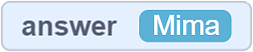
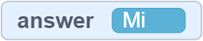
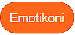
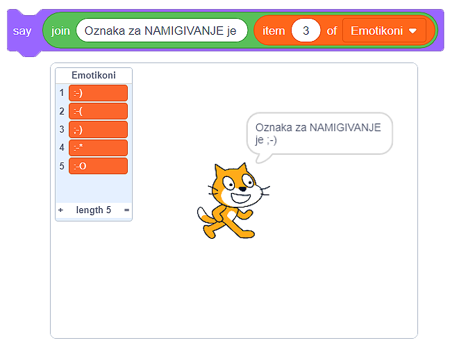
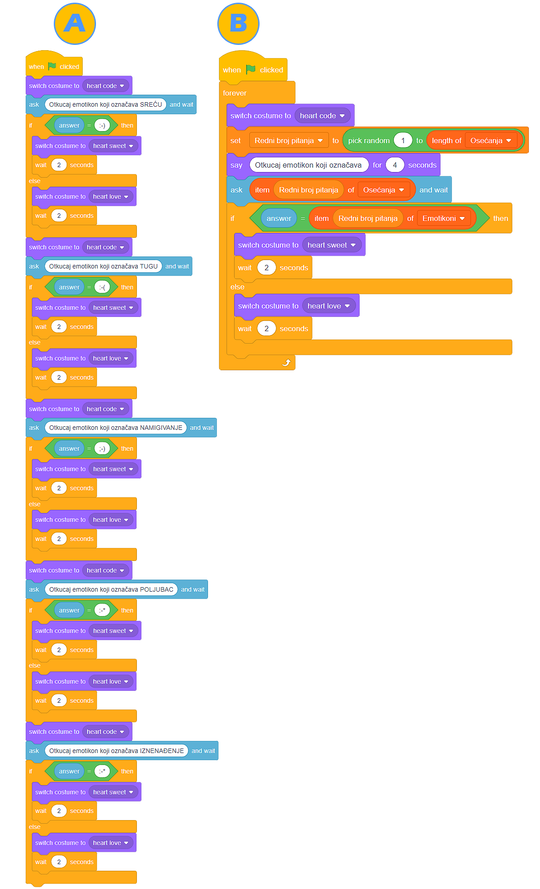

Списъци
--------

.. |MakeList| image:: ../_images/liste/MakeList.png

.. |Uradi| image:: ../_images/Uradi.png

.. mchoice:: ListeZadatak1
   :answer_a: Променливата съхранява няколко части с информация (числа, поредици, стойности Вярно или Грешно)
   :answer_b: Променливата съхранява само една част от информация (число, поредица, стойности Вярно или Грешно)
   :correct: b
   :feedback_a: Помислете за отговора си. Ако все още мислите същото, създайте тези програми в Scratch и ги стартирайте. Не забравяйте да подредите така, че стойностите на променливите да се виждат на сцената.
   :feedback_b: Браво!

   Създали сме променливата |VAnswer|. В един момент стойността на тази променлива е |AnswerMima|, а в друг момент е |AnswerMi|. Избери правилното твърдение:

В процеса на създаване на програма на програмистите често им се налага да съхраняват много данни (телефонни номера, имена на продукти, адреси и др.). В тези ситуации променливите, които сме използвали досега, не са особено полезни. 

Именно заради тези ситуации, които със сигурност ще срещнеш в бъдещето ти програмиране, ти представяме Списъка.

Списък е колекция от данни. Можем да го виждаме като „тетрадка”, съдържаща голям брой „страници”. Всяка страница има число (от 1 нататък) и един къс от информация е написан (съхранен) във всяка от „кутиите”.

Списък се създава в категорията **Променливи**, като кликнеш на бутона |MakeList|. ). Списък може да се отнася за един или за всички спрайтове в дадена програма. Елементите на списъка се въвеждат чрез кликване на знака + и чрез написване на стойностите в съответните полета.

.. image:: ../_images/liste/NewList.png  
   :align: center
   
За разлика от *обикновените променливи*, които се извикват чрез посочване на името им, всеки елемент от списъка може да бъде „призован” чрез посочване на техния номер (позиция) от списъка. 

Списъкът |Emotikoni| съдържа 5 компонента – текстови символи, обрисуващи изражения на лицето. Ако искаме котката да каже как намигането може да бъде обрисувано чрез използването на символи, трябва да направим следния списък: 

Направихме една и съща викторина, използвайки обикновени променливи и използвайки списъци. Анализирай техните текстове:

|Uradi| Миксирай програмите А и Б, които могат да бъдат намерени на А: |https://scratch.mit.edu/projects/326482978/| и B: |https://scratch.mit.edu/projects/326477714/|, като добавиш поне три въпроса, свързани с чувства и емоции, които ги представят. Не се съмняваме, че ще забележиш колко време сме спестили, използвайки списъци вместо променливи. 

.. |https://scratch.mit.edu/projects/326482978/| raw:: html

 <a href="https://scratch.mit.edu/projects/326482978/" target="_blank">https://scratch.mit.edu/projects/326482978/</a>

.. |https://scratch.mit.edu/projects/326477714/| raw:: html

 <a href="https://scratch.mit.edu/projects/326477714/" target="_blank">https://scratch.mit.edu/projects/326477714/</a>

