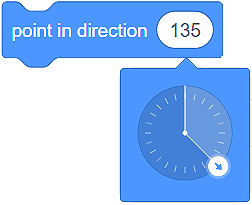

Движение
========

Вече се запознахме с потребителския интерфейс на Скрач, научихме се как да създаваме спрайтове и да определяме тяхната позиция на сцената. Сега е идеалният момент да научим как да ги движим чрез използването на команди (блокове) от категорията Движение. Тези блокове ще ни позволят да създаваме прости игри и анимации. 

Има 3 вида блокове, които можем да използваме, за да движим спрайта:

•	Блокове за абсолютно движение;

•	Блокове за относително движение;

•	Блокове за други движения.

Блокове за абсолютно движение
-----------------------------

В категорията **Движение** има 4 блока, които позволяват абсолютно движение.

.. image:: ../_images/kretanje/AKBlokovi.png  
   :align: center

Ще използваме тези блокове, когато трябва да програмираме спрайта ни да се движи по посока на **специфична локация (точка) на сцената**.

.. infonote::

    **Котката гони мишката…**
        
    Котката се намира в центъра на сцената, а мишката е в точката  **(x:150 y:100)**. 

    .. image:: ../_images/kretanje/MM1.png 
       :width: 400px
       :align: center

    
    Припомняме, че сцената е правоъгълна повърхност, широка 480 пиксела и висока 360 пиксела. Центърът има координати **(x:0 y:0)**.

.. |AK1| image:: ../_images/kretanje/AK1.png
.. |AK2| image:: ../_images/kretanje/AK2.png
.. |AK3| image:: ../_images/kretanje/AK3.png
.. |AK4| image:: ../_images/kretanje/AK4.png

Ако искаме котката да хване мишката, можем просто да използваме блока |AK1|.

.. image:: ../_images/kretanje/MM1a.png 
   :width: 400px   
   :align: center

Ако искаме гоненицата да продължи по-дълго, можем да използваме блока |AK2|. С този блок котката ще се плъзка 1 секунда от точка **(x:0 y:0)** до точка **(x:150 y:100).)**.

Използвайки блоковете |AK3| и |AK4| можем да направим да изглежда сякаш котката бавно се промъква към мишката:

.. image:: ../_images/kretanje/MM34a.png  
   :width: 800
   :align: center

Винаги можем да видим настоящата позиция на спрайта (моментните стойности на х: и у:) под сцената в листа на спрайтовете. 

.. image:: ../_images/kretanje/XY.png  
   :align: center

.. mchoice:: AKZadatak1
   :answer_a: Програма A
   :answer_b: Програма B
   :feedback_a: Браво!    
   :feedback_b: Хм.. Препоръчваме ти да прочетеш вйнимателно урока за позицията на спрайта на сцената.
   :correct: a

   Анализирай позицията на мишката, показана на фигурата по-долу, и избери програмата, която ще позволи на котката да хване всичките мишки. 

   .. image:: ../_images/kretanje/AKZ1.png
      :width: 700
      :align: center

.. |Vazno| image:: ../_images/Vazno.png

.. infonote::

    |Vazno|   **Така, чрез използването на блоковете за абсолютно движение показваме на спрайтовете точно къде трябва да отидат на сцената.**

Блокове за относително движение
--------------------------------

Относителното движение не се определя от локацията, в която спрайтът трябва да отиде, а от настоящата позиция на спрайта.

В категорията **Движение** имаме на разположение няколко блока, които позволяват относително движение.

.. image:: ../_images/kretanje/RKBlokovi.png  
   :align: center

В примера, при който котката гонеше мишката, знаехме точната локация на мишката (точката, в която се намира). Ситуациите, при които не знаем разположението на спрайта, са по-често срещани. При тези случаи ще използваме блокове за относително движение, за да движим спрайтовете.

Когато става въпрос за относително движение, е важно спрайтът да се насочи в правилната посока. Постигаме това чрез влачене на стрелката около кръга на блока |RKS2|. 

Добре е да се знае, че посока към 0 представлява нагоре, към 90 – надясно, към 180 – надолу, към -90 – наляво. 

.. image:: ../_images/kretanje/RKS1.png  
   :width: 800
   :align: center

Винаги можем да видим настоящата посока на спрайта под сцената в листа на спрайтовете в полето **Посока**.

.. image:: ../_images/kretanje/XY.png 
   :align: center

.. mchoice:: RKZadatak1
   :answer_a: Посока 90 (надясно) Позиция (x:50 y:-100)
   :answer_b: Посока 180 (надолу) Позиция (x:50 y:100)
   :feedback_a: Анализизрайте програмамта отново. Обръщането на спрайта с 90 градуса промени ли неговата посока?    
   :feedback_b: Браво!
   :correct: b

   Анализирай програмата, представена във фигурата, и избери посоката, която според теб има спрайта, какво и каква ще бъде позицията му след като края на действието на програмата. 

   .. image:: ../_images/kretanje/RKZ1.png
      :align: center

.. infonote::

    |Vazno|   **Така, чрез използването на блокове за относително движение казваме на спрайта накъде да се насочи и движи относително към настоящата му позиция.**

Блокове за други движения
--------------------------

В категорията **Движение** има още 4 блока на наше разположение, които позволяват на спрайта да се движи. 

.. image:: ../_images/kretanje/OKBlokovi.png   
   :align: center

.. |OK3| image:: ../_images/kretanje/OK3.png

.. |OK4b| image:: ../_images/kretanje/OK4b.png

Сцената е ограничено пространство. Когато спрайтът достигне ръба на сцената, за него ще бъде естествено да се обърне и да продължи да се движи в другата посока. Ще осъществим това движение на спрайта чрез използването на блока |OK3|. Също така ще решим как ще продължи да се движи спрайтът. Ако вътре в блока the |OK4a| определим начина на ротация на спрайта да е изцяло, той ще продължи да се движи наопаки. Това няма да се случи, ако от падащото меню на блока изберем опцията ляво-дясно |OK4b|.

.. image:: ../_images/kretanje/OKRub12.png
   :width: 800
   :align: center

Винаги можем да видим настоящия начин на движение на спрайта под сцената в листа със спрайтовете – в полето **Посока (Direction)**.

.. image:: ../_images/kretanje/XY.png
   :width: 400px   
   :align: center

Нека се върнем към спрайтовете: |macka| и |mis|. 

.. |OK1| image:: ../_images/kretanje/OK1.png
.. |OK1a| image:: ../_images/kretanje/OK1a.png

.. |mis| image:: ../_images/kretanje/mis.png

Ако не знаем точната позиция на мишката, а искаме котката да е насочена към нея, можем да използваме блока |OK1|. Просто трябва да изберем Мишката спрайт |OK1a| от падащото меню и проблемът е решен. 

Ще ти покажем как последните два блока работят в следния пример. 

.. infonote::

    **Котката преследва мишката...**
        
    Котката преследва мишката, плъзгайки се към нея. Мишката непрекъснато се обръща и се движи към стрелката, която местим по сцената.

    .. image:: ../_images/kretanje/OKPR1.png   
       :align: center

    
    Над всеки от спрайтовете има текствове, които правят възможно описаното поведение.  

.. |Izazov| image:: ../_images/Izazov.png

|Izazov| Подобри програмата, показано по-горе, добавяйки още един спрайт – ябълка. Направи така, че мишката да гони ябълката, а котката да гони мишката. Направи така, че ябълката да се движи по стрелката (която ние контролираме), мишката да се движи по ябълката и котката да се движи по мишката. 

.. image:: ../_images/kretanje/MMJ.png  
   :width: 400
   :align: center

.. reveal:: sakrivanjeKretanje
   :showtitle: Сравни решението си с нашето
   :hidetitle: Скрий решението
 
   **Possible solution:**
     
   .. youtube:: QgCCzBw6DKU
      :width: 735
      :height: 415
      :align: center
   
