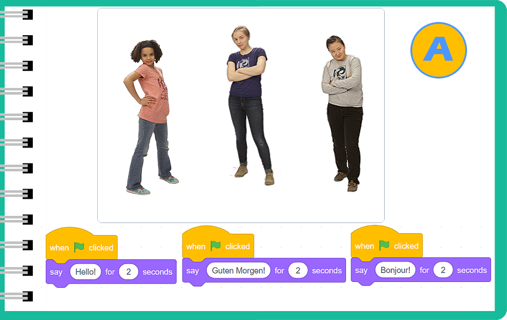
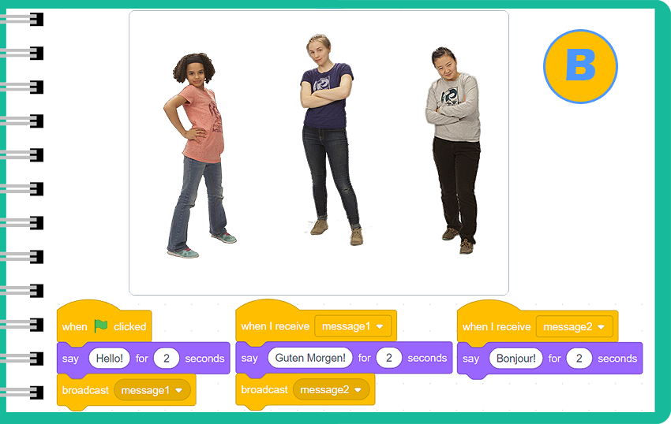
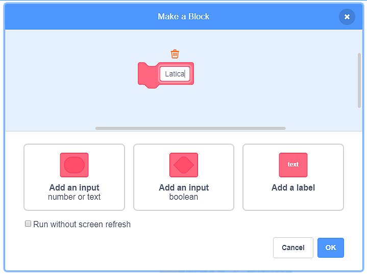
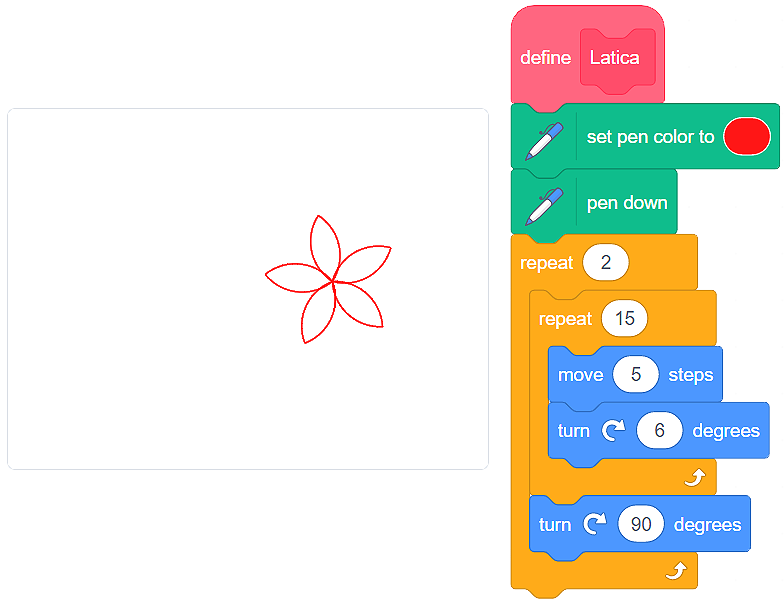

Процедури
===========

Не е нужно да създаваме цялата програма.

Би било много по-ясно, ако раздели парчета от кода на по-малко отделни части – **продедури**. Дефинирането на процедури прави писането на програми и намирането на грешки по-лесно. Затова е добре да пазим процедурите в нашата „раница”. По този начин ще можем да ги използваме в други програми, които създаваме, без да губим време в повторното им създаване.

Предаване
-------------

Програмите, направени в Скрач, обикновено имат няколко спрайта, които общуват помежду си. Можем сами да дефинираме общуването или да използваме вградената процедура, която позволява на спрайтовете да предават съобщения и да влияят на работата на програмата. Използването на процедурата за предаване значително ще намали броя на блоковете в програмата и ще направи по-лесно за нас да прочетем кода. 

.. mchoice:: ProcedureZ1
   :answer_a: Програма A
   :answer_b: Програма B
   :feedback_a: Когато стартираме програмата, можем да видим, че и трите момичета се поздравяват на своя език по едно и също време. Това не би се случило в реалния живот, по време на нормален разговор. Обикновено слушаме човека, с когото говорим, и тогава говорим ние.    
   :feedback_b: Прав си! Когато излъчваме съобщенията, позволяваме на всички, които участват в разговора, да бъдат учтиви - и да не се прекъсваме взаимно.
   :correct: b

   : Има 2 програми – А и Б, представени във фигурите отгоре. И двете програми съдържат 3 спрайта, момичета, говорещи английски, немски и френски. Под всяко момиче има блокове, които принадлежат към тях (блоковете им позволяват да кажат „здрасти” на другите две на собствения си език). Създай програми, които виждаш във фигурите отгоре. Анализирай какво се случва, когато се задействат. Коя програма представя симулация на нормален разговор между трима непознати? 

.. reveal:: sakrivanjeDevojke
   :showtitle: Watch the video instruction for creating the conversation between three girls
   :hidetitle: Hide the video instruction
 
   **Гледай видео инструкцията за създаване на разговор между трите момичета:**
     
   .. youtube:: QgCCzBw6DKU
      :width: 735
      :height: 415
      :align: center

Дефиниране на нова процедура
-----------------------------

.. |Vazno| image:: ../_images/Vazno.png

.. |Uradi| image:: ../_images/Uradi.png

В Скрач можем да създадем нова процедура, която да отговаря на нуждите ни. 

Представи си, че искаме да създадем програма, която рисува цвете на сцената. Цветето е направено от венчелистчета. Следователно, нуждаем се от две процедури:

•	**Венчелистче**, в което ще дефинираме рисуването на едно венчелистче и
•	**Цвете**, в което ще дефинираме рисуването на 5 венчелистчета.

С други думи, процедурата Цвете ще извика процедурата **Венчелистче** и основната програма ще извика процедурата **Цвете**.

Създаваме процедура като кликнем на категорията **Моите блокове**, където трябва да кликнем на бутона **Направи блок**. Ще се отвори прозорец, който ще ни позволи да дадем име на нашата процедура. 

Ако искаме цветето да има същите венчелистчета като това на фигурата отдолу, създаваме процедурата **Венчелистче**, която представихме:

|Uradi| Ще те оставим да създадеш процедура, която рисува 5 венчелистчета. **Малко помощ**: След като нарисуваш едно венчелистче, трябва да завъртиш спрайта 72 градуса надясно.

.. reveal:: sakrivanjeCvet1
   :showtitle: Сравни своето решение с нашето
   :hidetitle: Hide the solution
 
   **Possible solution**
     
    .. image:: ../_images/procedure/Cvet.png
	:width: 770px   
	:align: center

.. infonote::

  |Vazno|   **Така, чрез използването на процедури правим писането на програми и намирането на грешки по-лесно.**

   
   
