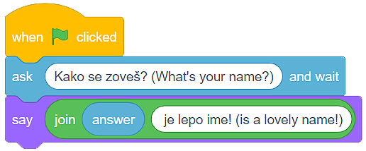
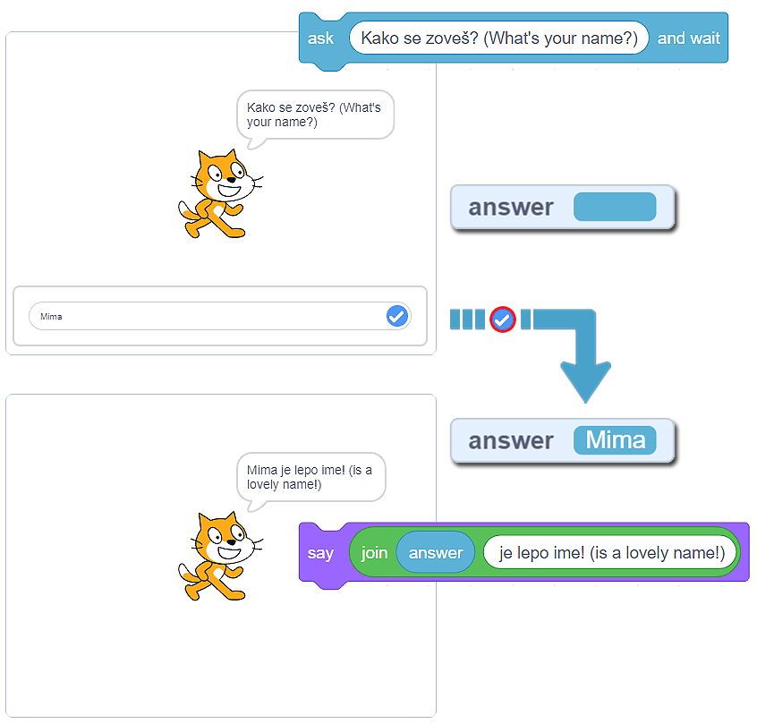
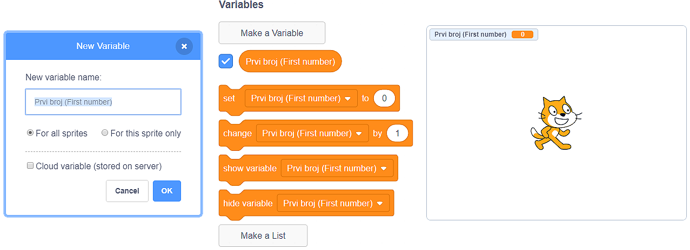

Променливи
===========

Вярваме, че знаеш, че няколко души могат да използват една програма и че знаеш това от личен опит. Създаваме програми с намерението да направим разрешаването и извършването на задачи по-лесно. Създаваме ги, за да се забавляваме, да си почиваме, да се свързваме с други хора.

Фактът, че една програма може да се използва от няколко души, които въвеждат своите данни и получават съответните резултати, ни казва, че програмирането има отлична концепция за управляването и използването на компютърната памет.

Мисли за паметта на дигитално устройство като за голяма, направо огромна, почти безкрайна стая с редове и редове от рафтове. Сега си представи, че можеш да сложиш данни във всяко отделение на всеки рафт. Накрая си представи, че можеш да дадеш име на всяко от тези отделения, каквото си пожелаеш, и назовеш ли името, информацията в него става достъпна веднага.

Тези отделения наричаме променливи на компютърната памет. Променливата може потенциално да съдържа само една информация (число, нишка, стойности вярно или грешно и др.).

Попитай и изчакай
------------------

В категорията Усещане има блок **Попитай и изчакай** |BlokAskWait|. Тези блокове ни позволяват да питаме потребителя нещо (обикновено под формата на молба или въпрос) и после да изчакаме да кликне бутона |Stikliranje| или да натисне *Enter*.
  .. |BlokAskWait| image:: ../_images/promenljive/BlokAskWait.png
  .. |Stikliranje| image:: ../_images/promenljive/Stikliranje.png

Отговорът на потребителя се въвежда в променливата |VAnswer|, и програмата продължава да работи.
    .. |VAnswer| image:: ../_images/promenljive/VAnswer.png

|Uradi| Най-добре е да използваме този блок веднага. Ще създадем програма, в която котката пита потребителя за неговото име и след това повтаря името, казвайки, че е прекрасно име.
  .. |Uradi| image:: ../_images/Uradi.png

Следователно, ще задействаме програмата, като кликнем на зеления флаг. След командата |BlokAsk|, програмата спира да работи, очаквайки потребителя да напише отговора си във вътрешното поле и да кликне бутона |Stikliranje| или натиснете *Enter*. В този момент съдържанието на променливата |VAnswer| не съществува |Answer|.
    .. |BlokAsk| image:: ../_images/promenljive/BlokAsk.png
    .. |Answer| image:: ../_images/promenljive/Answer.png

Когато потребителят въведе отговора (например – Мима) и кликне на бутона |Stikliranje| или натисне Enter, съдържанието на променливата |VAnswer| ще бъде |AnswerMima|.
    .. |AnswerMima| image:: ../_images/promenljive/AnswerMima.png

Сега котката може да каже нишката |BlokSay|, която ние направихме, използвайки блока за свързване на нишки |Join| (в полето ябълка поставихме променливата |VAnswer|, и в полето банан поставихме нишката „е прекрасно име!”. 
    .. |Join| image:: ../_images/promenljive/Join.png
    .. |BlokSay| image:: ../_images/promenljive/BlokSay.png

Във фигурата отдолу можем да видим програмата, когато работи.

Създаване на променливи
-----------------------

Да погледнем ситуацията, в която потребителят въвежда 4 числа, след това програмата добавя числата и показва сбора. Вярно е, че блокът Попитай и изчакай (image) позволява на потребителя да въвежда определена стойност, която след това ще бъде поставена в променливата (image). Въпреки всичко, какво се случва, когато се нуждаем от 4 отговора?

.. mchoice:: Promenljive1
   :answer_a: 50
   :answer_b: 30
   :answer_c: 20
   :answer_d: 80
   :correct: d
   :feedback_a: Променливата съдържа само една информация (число, низ, стойност вярна или невярна и т.н.). Помислете отново и изберете правилния отговор. 
   :feedback_b: Променливата съдържа само една информация (число, низ, стойност вярна или невярна и т.н.). Помислете отново и изберете правилния отговор. 
   :feedback_c: Променливата съдържа само една информация (число, низ, стойност вярна или невярна и т.н.). Помислете отново и изберете правилния отговор.
   :feedback_d: Браво! Променливата |VAnswer| съдържа само окончателния отговор на потребителя и това е номер 20. Спрайтът ще каже 80 (20 + 20 + 20 + 20).

   Потребителят въвежда следните числа едно след друго: 5, 10, 15 и 20. Когато програмата, показана във фигурата работи, спрайтът ще каже: 

   .. image:: ../_images/promenljive/4pitanja.png   
     :align: center

Очевидно е, че се нуждаем от повече от една променлива, за да може програмата да покаже правилния сбор. 

Ние създаваме променливите в категорията Променливи, като кликнем на бутона Създай променлива. Ще се отвори прозорец, където можем да напишем името на променливата, и след това ще решим дали искаме да я направим достъпна за всички спрайтове или само за спрайтовете, които са активни, докато създаваме променливата. Също така, можем да пробваме опцията, която запазва променливата на сървъра в облака данни. Накрая, кликването на бутона ОК създава променливата. 

Във фигурата  можем да видим блока, който ще стане достъпен за нас, когато създадем променливата. С първия блок ще определим стойността на променливата, втория можем да използваме, ако искаме да увеличим или намалим тази стойност, докато третият и четвъртият се използват, за да се направи променливата видима или за да се скрие. 

.. mchoice:: Promenljive2
   :answer_a: Скриптовете на текстове А и Б дават един и същи резултат;
   :answer_b: Скриптовете на текстове А и Б дават различни резултати:
   :correct: a
   :feedback_a: Браво! Въпреки че са различни, изпълнението на двете програми има един и същ резултат.
   :feedback_b: Помислете за отговора си. Ако все още мислите същото, създайте тези програми в Scratch и ги стартирайте. Не забравяйте да ги подредите така, че стойностите на променливите да се виждат на сцената.

   Анализирай текстовете и отбележи правилното твърдение: 

   .. image:: ../_images/promenljive/4brojaProm.png   
     :align: center

